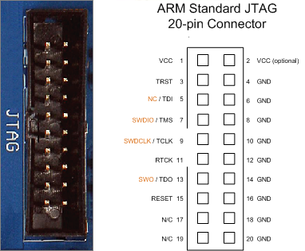

# OINKERS NEW GENERATION DIY SINGLE BUTTON PRESSURE SENSING MACRO KEYBOARD

## Description

**OINKERS** - new generation DIY single button pressure sensing macro keyboard

## Features

- Written fully in **SAFE** Rust
- Fully programmable single macro key
- Adjustable pressure level sensors
- Pinky and soft
- Can oink

## PRE-ORDER NOW

EXTRA LOW price during PRE-ORDER: **ONLY 69.09$**

## Support materials

### Segger Jlink JTAG 20 pinout

### Blackpill

[WeAct Black Pill V2.0](https://stm32-base.org/boards/STM32F411CEU6-WeAct-Black-Pill-V2.0.html)

### Air pressure sensor

[sensor](http://wiki.sunfounder.cc/index.php?title=BMP280_Pressure_Sensor_Module)

